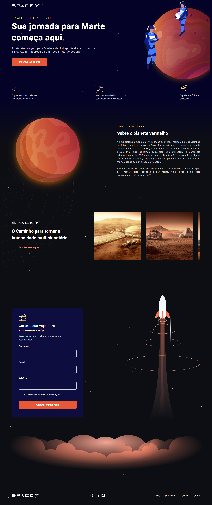

<p align="center">
  
</p>

<h1 align="center">
    
</h1>

<br>

## ⚙️ Tecnologias
Este projeto foi desenvolvido utilizando:

- [ReactJS](https://reactjs.org/)
- [Typescript](https://www.typescriptlang.org/)
- [Styled Components](https://styled-components.com/)
- [Framer Motion](https://framer.com/motion/)

## 📌 Começando

Clone o projeto:

```bash
git clone https://github.com/gabrielcoutinh0/space-y.git
cd space-y
```

Instale as dependências :

```bash
yarn install
yarn start
```

## 🖼️ Layout de inspiração
- [Figma](https://www.figma.com/community/file/986447430009792279/duplicate)
